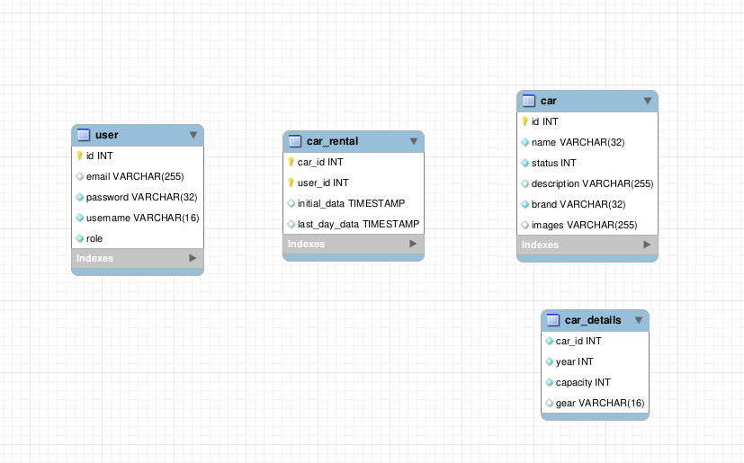

<h1 align="center"> Projeto em Andamento </h1>

 Descrição do Projeto 

### Steps:
 - [X] Ideia base do Projeto
 - [X] Decisão das tecnologias e ferramentas utilizadas.
 - [X] Arquiteturas e padroes adotados.
 - [ ] Estrutura do Back-end.
 - [ ] Continuação...

 

### Ideia base do Projeto

Plataforma de aluguel de carros.

A ideia do projeto é criar uma aplicação onde para o cliente é possivel alugar carros entre determinadas datas, e para os gerentes, sera possivel registrar novos carros, deletar carros presentes para aluguel ou modifica-los

### Tecnologias e Ferramentas

Para Backend:

- Node.js
- Typescript
- Express
- Sequelize
- JWT
- MySQL ou Postgresql

   

Para Front-end: 

- Next
- Typescript
- Sass

### Arquitetura

Arquitetura de Camadas MSC

### Estrutura do Backend.

 Diagrama do Banco de dados

Criação dos endpoints em andamento...
